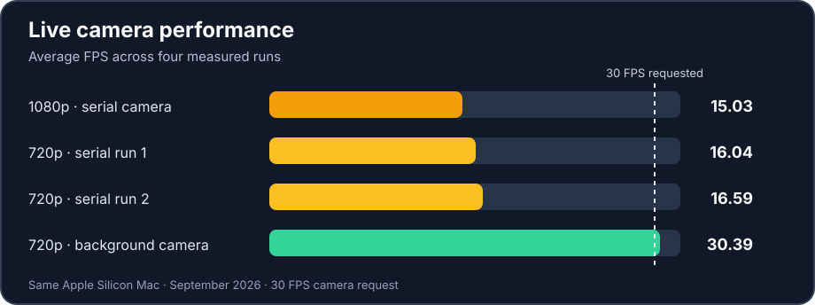

# Air Rhythm

Air Rhythm turns tracked hand movements into music. Players touch falling notes with their fingertips to perform a short melody or improvise in free play. I built it as a portfolio project to demonstrate real-time computer vision, interaction design, and measured performance.

## What I built

- A live camera pipeline that keeps the newest frame available while hand tracking and rendering run.
- Adaptive hand-landmark smoothing, stable hand identities, and fingertip-path collision checks for responsive two-hand play.
- A person-free performance stage with virtual drumsticks, a small live camera-and-skeleton inset, timed notes, score feedback, and synthesized audio.

## Tech stack, model, and music

| Technology | Role |
| --- | --- |
| Python + OpenCV | Camera input, image processing, rendering, and the live interface |
| MediaPipe Hand Landmarker | **Pretrained** model estimating 21 landmarks for each of up to two hands |
| NumPy + sounddevice | Generated tones and output-only audio playback |

MediaPipe provides the hand model; this project did **not** train it. The camera pipeline, landmark filtering, fingertip interaction, rhythm logic, audio engine, and interface are project code built around its output. An original gesture classifier is planned for later.

The challenge uses a simplified 35-note opening of Beethoven's *Für Elise*, based on a [public-domain score](https://www.mutopiaproject.org/ftp/BeethovenLv/WoO59/fur_Elise_WoO59/fur_Elise_WoO59-let.pdf). Its pitches become scheduled falling circles; a hit plays the circle's pitch through sounds generated by the app. No song recording is bundled.

## Measured performance

On the test Mac, average FPS rose from **15.03 to 30.39** and average frame processing fell from **50.41 ms to 20.12 ms**. The final 64.67-second run recorded **zero estimated dropped frames**. Resolution changed from 1080p to 720p during this work; moving camera reads to a background worker produced the largest improvement. These are measured results for this setup, not a guaranteed rate on every computer. [Read the full performance study](docs/PERFORMANCE_STUDY.md).

## Explore the project

| Guide | What it covers |
| --- | --- |
| [Getting Started](docs/GETTING_STARTED.md) | Download ZIP or clone, install, run, and troubleshoot |
| [Play Guide](docs/PLAY_GUIDE.md) | Controls, challenge rules, scoring, music, and privacy views |
| [Technical Overview](docs/TECHNICAL_OVERVIEW.md) | Model boundaries, camera-to-audio pipeline, and code structure |
| [Performance Study](docs/PERFORMANCE_STUDY.md) | Benchmark method, before-and-after data, and limitations |
| [Future Plan](FUTURE_PLAN.md) | Demo, robustness tests, and future ML work |

The live prototype and performance benchmark are complete. Final demo recording and broader tracking checks are still in progress.
